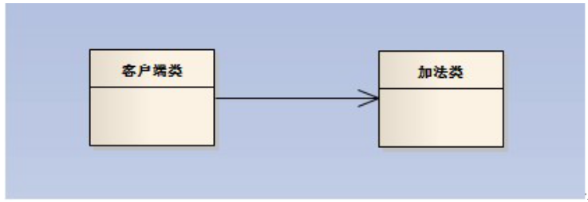
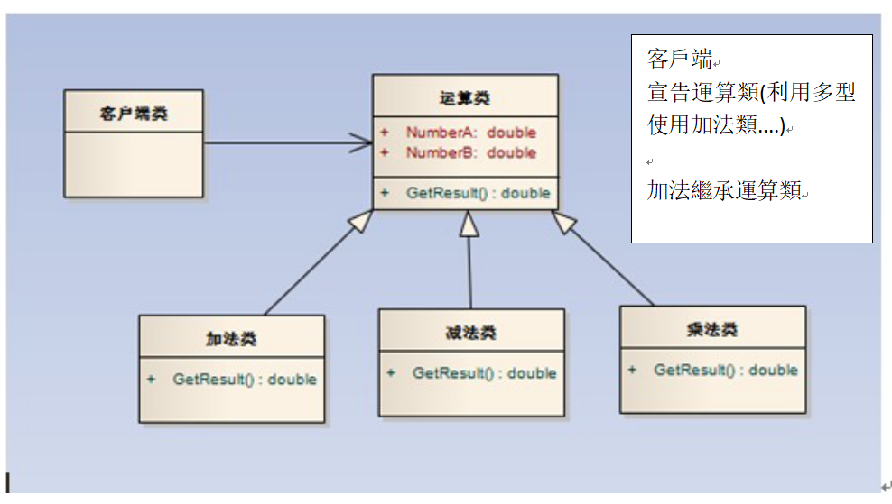
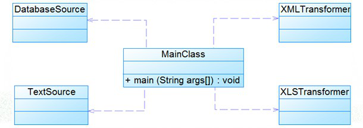
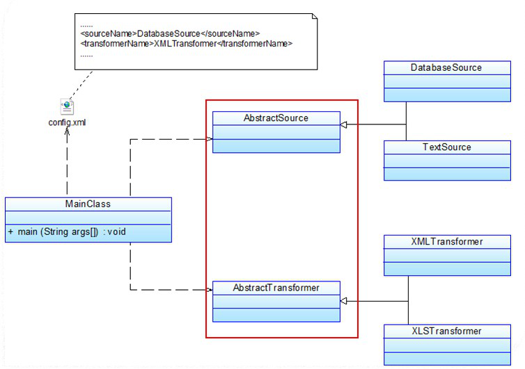
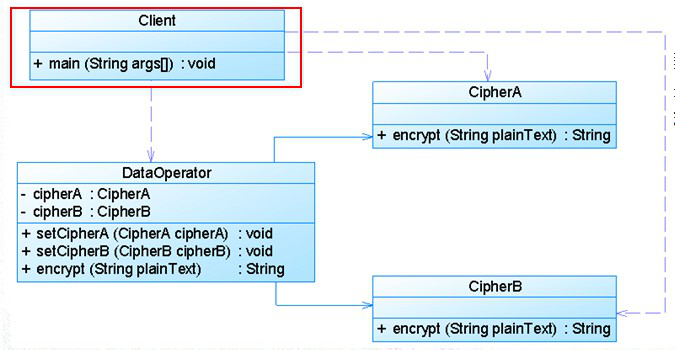
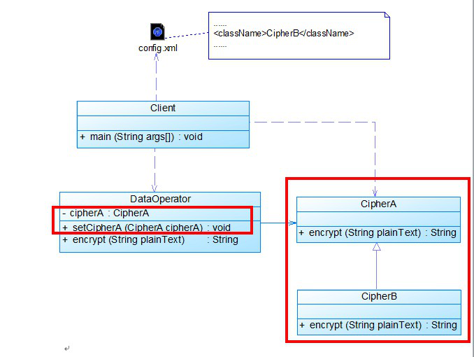

# 設計模式原則


<!--
标签（空格分隔）： 設計模式
 -->
---

# 設計基礎


## 1.抽象

- 就是C＃將類給抽象化就是這只是類的模版，無法實例化

- 抽象與虛擬差異在於，抽象需要override 重寫，虛擬方法可以先寫好，要不要override 隨意

> 詳見 [(C#) 區分 abstract、virtual、override 和 new](http://jimmy0222.pixnet.net/blog/post/37271702)

> abstract => 抽象方法。
> 
> virtual => 虛擬方法。
> 
> override => 覆蓋基礎類別方法。
>
> new => 隱藏基礎類別方法。
> 
> override 和 new 有時都叫覆寫基礎類別方法。
> 

## 2.封裝

- 就是將數據封起來，避免被其他類引用，有以下這些方法，
  但實際上有其他方法，EX：用Void來取得數據

- 而且封裝在物件導向有時不是指數據封裝，是指類別封裝，將類別關起來

> public：所有對象都可以訪問；
> 
> private：對象本身在對象內部可以訪問；
> 
> protected：只有該類對象及其子類對象可以訪問
> 
> internal：同一個程式集的對象可以訪問；
> 
> protected internal：訪問限於當前程式集或派生自包含類的類型。
> 
> get {return _firstName;}set {_firstName = value;} <=利用函式取得封裝數據


## 3.繼承
- 指的是子類繼承父類，而子類有父類所有非私有的數據，就是把父類的程式碼塞到子類裡
- C＃ 只能單一繼承

```csharp
public class A //父類
{
Protected int value = 10;
}

public class B : A//子類
{
public int GetValue(){return this.value;}
}

ClassB繼承後實際上程式碼變成這樣
public class B //子類
{
protected int value = 10;//這是父類的
public int GetValue(){return this.value;}//這是子類的
}
```

## 4.多態

- 就是一個類可以有很多種型態
	<br>EX:當子類繼承父類，宣告父類陣列時，子類也能放進去，因為子類有父類的型態
	<br>EX2:當類繼承介面Interface 宣告Interface 陣列時該類也能放進去，因為該類有Interface 型態

- 還有就是Void（函示）多態，只要後面接的變數不一樣，函示名字可以一樣
```
EX: 
Test()
Test(int a)
Test(int a,string b)
```


----------


# 設計模式7大原則

## 1.開閉原則

> 詳見 [程序员必备的七大面向对象设计原则（一）](https://blog.csdn.net/qiulongtianshi/article/details/7570021)

### **定義 : 對擴展開放，對修改關閉** 

#### 原則:
1. 開閉原則由Bertrand Meyer於1988年提出，它是面向對象設計中最重要的原則之一。
2. 在開閉原則的定義中，軟體實體可以指一個軟體模組、一個由多個類組成的局部結構或一個獨立的類。
3. 抽象化是開閉原則的關鍵。
4. 開閉原則還可以通過一個更加具體的“對可變性封裝原則”來描述，對可變性封裝原則(Principle of Encapsulation of Variation,EVP)要求找到系統的可變因素並將其封裝起來。


#### 案例:





##### 對比分析

- 圖（1）：客戶端的一個方法直接調用加法類，但是我想添加一個減法類，你就會發現添加減法類就得改變加法類中代碼（用switch語句實現），這就違背了“開閉原則”，於是我們就應該重新重構。

- 如圖（2）在這個圖中我們添加了一個運算類的父類，這樣我們再添加減法類的時候就不用修改客戶端類。

<!--
# **開閉原則總結：**
# **面對需求，對程式的改動是通過增加新代碼進行的，而不是改變原來的代碼。**
-->


<b>
<font face="微软雅黑" color="red" size="10">
開閉原則總結：<br>
面對需求，對程式的改動是通過增加新代碼進行的，而不是改變原來的代碼
</font>
</b>


--------

## 2.依賴倒轉原則

> 參考附錄(一)高層模組和底層模組

> 詳見 [程序员必备的七大面向对象设计原则（二）](https://blog.csdn.net/qiulongtianshi/article/details/7607192)

### 定義

- 依賴倒轉原則定義
   - 高層模組不應該依賴低層模組，它們都應該依賴抽象。抽象不應該依賴於細節，細節應該依賴於抽象。
   - 要針對介面編程，不要針對實現編程。

### 分析

- 依賴倒轉原則分析
   1. 簡單來說，依賴倒轉原則就是指：代碼要依賴於抽象的類，而不要依賴於具體的類；要針對介面或抽象類編程，而不是針對具體類編程。

   1. 實現開閉原則的關鍵是抽象化，並且從抽象化導出具體化實現，如果說開閉原則是面向對象設計的目標的話，那麼依賴倒轉原則就是面向對象設計的主要手段。

    1. 依賴倒轉原則的常用實現方式之一是在代碼中使用抽象類，而將具體類放在配置檔中。

    1. 類之間的耦合 
	   - 1.零耦合關係 
	   - 2.具體耦合關係  
	   - 3.抽象耦合關係。
	   - 依賴倒轉原則要求客戶端依賴於抽象耦合，以抽象方式耦合是依賴倒轉原則的關鍵。

    1. 依賴注入:
		- 構造注入：通過構造函數注入實例變數
		- 設值注入：通過Setter方法注入實例變數
		- 介面注入：通過介面方法注入實例變數

#### 案例:





##### 對比分析

因為該系統可能需要增加新的數據源或者新的檔格式，每增加一個新的類型的數據源或者新的類型的檔格式，客戶類MainClass都需要修改源代碼，以便使用新的類，但違背了開閉原則。現使用依賴倒轉原則對其進行重構。

<!--
# **依賴倒轉原則總結：**
# **高層模組不應該依賴底層模組，兩個都應該依賴與抽象；抽象不應該依賴於細節，細節應該依賴於抽象。**
-->

<b>
<font face="微软雅黑" color="red" size="10">
依賴倒轉原則總結：<br>
高層模組不應該依賴底層模組，兩個都應該依賴與抽象；抽象不應該依賴於細節，細節應該依賴於抽象。
</font>
</b>

----------

## 3.裏氏替換原則

> 詳見 [程序员必备的七大面向对象设计原则（二）](https://blog.csdn.net/qiulongtianshi/article/details/7607192)

>詳見[设计模式六大原则（2）：里氏替换原则](https://blog.csdn.net/zhengzhb/article/details/7281833)

### 定義

>派生類（子類）對象可以在程式中代替其基類（超類）對象。

### 裏氏替換原則通俗的來講就是：
 - #### ***子類可以擴展父類的功能，但不能改變父類原有的功能。***

- #### 它包含以下4層含義：

   1. 子類可以實現父類的抽象方法，但不能覆蓋父類的非抽象方法。
   2. 子類中可以增加自己特有的方法。
   3. 當子類的方法重載父類的方法時，方法的前置條件（即方法的形參）要比父類方法的輸入參數更寬鬆。
   4. 當子類的方法實現父類的抽象方法時，方法的後置條件（即方法的返回值）要比父類更嚴格。


#### 案例:

某系統需要實現對重要數據（如用戶密碼）的加密處理，在數據操作類(DataOperator)中需要調用加密類中定義的加密演算法，系統提供了兩個不同的加密類，CipherA和CipherB，它們實現不同的加密方法，在DataOperator中可以選擇其中的一個實現加密操作。如圖所示：





##### 對比分析

圖（一）為什到圖（二）哪？因為如果需要更換一個加密演算法類或者增加並使用一個新的加密演算法類，如將CipherA改為CipherB，則需要修改客戶類Client和數據操作類DataOperator的源代碼，違背了開閉原則。現使用裏氏代換原則對其進行重構，使得系統可以靈活擴展，符合開閉原則。

<!--
# **裏氏替換原則總結：**
# **子類型必須能夠替換掉它們的父類型。**
-->

<b>
<font face="微软雅黑" color="red" size="10">
裏氏替換原則總結：<br>
子類型必須能夠替換掉它們的父類型。
</font>
</b>

----------

# 附錄

## 附錄(一)高層模組和底層模組

### 依賴倒置原則裏面，什麼叫高層模組和底層模組？

>作者：蓋拉斯
>鏈接：https://www.zhihu.com/question/58471765/answer/311356521
>來源：知乎
>著作權歸作者所有。商業轉載請聯繫作者獲得授權，非商業轉載請注明出處。

#### **可以簡單的理解：調用者為高層，被調用者為低層。**

關於這個模式，舉個現實生活中的例子：
某地市場上有很多肉店。你想在這裏開一家餃子館，由於當地法律規定餃子店不能自己剁肉，必須使用肉店提供的剁餡服務，所以你的採購員每天去肉店下單買肉，然後等現場剁成肉餡後再帶回店裏做成豬肉餃子。

餃子店生意還不錯，但是你是個有理想的店主，不甘心賣一輩子豬肉餃子，所以你決定……拓展一下店裏的餃子品種。經過一番調研，你發現有三家肉店的老闆剛好家裏種了白菜、芹菜和韭菜——所以這三家還分別供應白菜肉餡、芹菜肉餡和韭菜肉餡。於是你在菜單上就增加了這三種蔬菜肉餡的餃子。由於你的採購員一天最多只能跑兩個地兒，而現在每天要跑三家肉店，一個人忙不過來，於是你不得不新招了一位採購員。

過了一陣，某肉店老闆參加了一場設計模式，哦不，商業模式的培訓，回去後就推出了一項新的服務：可以允許你自己把任何蔬菜類的食材帶過去，然後幫你做對應的蔬菜肉餡。你作為一個奸商（誤）一聽到這消息高興壞了，現在採購員只需要跑一下菜市場，然後跑一下這家肉店，就能滿足店內的三種肉餡需要了。甚至以後想拓展更多種類的肉餡也沒有什麼額外負擔。所以新招的採購員分分鐘就被你辭退了。

這就是依賴倒置。你的餃子店是高層模組，肉店則是低層模組。
混合肉餡依賴一種蔬菜食材，但原先的店都是自己準備固定的某種蔬菜，所以每當你想多賣一種蔬菜肉餡餃子，都得先看看有沒有提供這種餃子餡的肉店。但後來的這家肉店，把做肉餡所依賴的蔬菜食材交給你來決定，所以你的採購方案和菜單制訂一下子就變得非常靈活，任何蔬菜肉餡，只要菜市場能買到對應的蔬菜，你就可以交給這家店幫你做好。通過這種模式，一家肉店就解決了你的需求。

