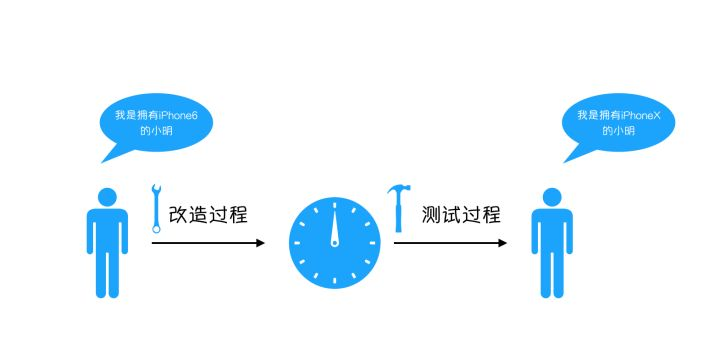

# 附錄二 浅谈控制反转与依赖注入
> 作者：[胡小国](https://www.zhihu.com/people/hu-xiao-guo-31)
> 鏈接：[https://zhuanlan.zhihu.com/p/33492169](https://zhuanlan.zhihu.com/p/33492169)
> 來源：知乎
> 著作權歸作者所有。商業轉載請聯繫作者獲得授權，非商業轉載請注明出處。


### 第一章：小明和他的手机
从前有个人叫小明
小明有三大爱好，抽烟，喝酒…… 咳咳，不好意思，走错片场了。应该是逛知乎、玩王者农药和抢微信红包

我们用一段简单的伪代码，来制造一个这样的小明

```javascript
class Ming extends Person
{
    private $_name;
    private $_age;
    function read()
    {
        //逛知乎
    }
    function  play()
    {
        //玩农药
    }
    function  grab()
    {
        //抢红包
    }
}
```

但是，小明作为一个人类，没有办法仅靠自己就能实现以上的功能，他必须**依赖**一部手机，所以他买了一台iphone6，接下来我们来制造一个iphone6

```javascript
class iPhone6 extends Iphone
{
    function read($user="某人")
    {
        echo $user."打开了知乎然后编了一个故事 \n";
    }
    function play($user="某人")
    {
        echo $user."打开了王者农药并送起了人头 \n";
    }
    function grab($user="某人")
    {
        echo $user."开始抢红包却只抢不发 \n";
    }
}
```

小明非常珍惜自己的新手机，每天把它牢牢**控制**在手心里，所以小明变成了这个样子

```javascript
class Ming extends Person
{
    private $_name;
    private $_age;
    public function  __construct()
    {
        $this->_name = '小明';
        $this->_age = 26;
    }
    function read()
    {
        //……  省略若干代码
        (new iPhone6())->read($this->_name); //逛知乎
    }
    function  play()
    {
        //……  省略若干代码
        (new iPhone6())->play($this->_name);//玩农药
    }
    function  grab()
    {
        //……  省略若干代码
        (new iPhone6())->grab($this->_name);//抢红包
    }
}
```

今天是周六，小明不用上班，于是他起床，并依次逛起了知乎，玩王者农药，并抢了个红包。
```javascript
$ming = new Ming();  //小明起床
$ming->read();
$ming->play();
$ming->grab();
```
这个时候，我们可以在命令行里看到输出如下
```javascript
小明打开了知乎然后编了一个故事 
小明打开了王者农药并送起了人头 
小明开始抢红包却只抢不发
```
这一天，小明过得很充实，他觉得自己是世界上最幸福的人。


### 第二章： 小明的快乐与忧伤

小明和他的手机曾一起度过了一段美好的时光，一到空闲时刻，他就抱着手机，逛知乎，刷微博，玩游戏，他觉得自己根本不需要女朋友，只要有手机在身边，就满足了。
可谁能想到，一次次地系统更新彻底打碎了他的梦想，他的手机变得越来越卡顿，电池的使用寿命也越来越短，一直到某一天的寒风中，他的手机终于耐不住寒冷，头也不回地关了机。
小明很忧伤，他意识到，自己要换手机了。
为了能获得更好的使用体验，小明一咬牙，剁手了一台iphoneX，这部手机铃声很大，电量很足，还能双卡双待，小明很喜欢，但是他遇到一个问题，就是他之前过度依赖了原来那一部iPhone6，他们之间已经深深耦合在一起了，如果要换手机，他就要拿起刀来改造自己，把自己体内所有方法中的iphone6 都换成 iphoneX。

漫长的改造过程
经历了漫长的改造过程，小明终于把代码中的 iphone6 全部换成了 iphoneX。虽然很辛苦，但是小明觉得他是快乐的。
于是小明开开心心地带着手机去上班了，并在回来的路上被小偷偷走了。
为了应急，小明只好重新使用那部刚刚被遗弃的iphone6，但是一想到那漫长的改造过程，小明的心里就说不出的委屈，他觉得自己过于**依赖**手机了，为什么每次手机出什么问题他都要去改造他自己，这不仅仅是**过度耦合**，简直是**本末倒置**，他向天空大喊，我不要再**控制**我的手机了。
天空中的造物主，也就是作为程序员的我，听到了他的呐喊，我告诉他，你不用再控制你的手机了，交给我来管理，把控制权交给我。这就叫做**控制反转**。


### 第三章：造物主的智慧

小明听到了我的话，他既高兴，又有一点害怕，他跪下来磕了几个头，虔诚地说到：“原来您就是传说中的造物主，巴格梅克上神。我听到您刚刚说了 **控制反转** 四个字，就是把手机的控制权从我的手里交给你，但这只是您的想法，是一种思想罢了，要用什么办法才能实现控制反转，又可以让我继续使用手机呢？”
“呵“，身为造物主的我在表现完不屑以后，扔下了四个大字，“依赖注入！”

接下来，伟大的我开始对小明进行惨无人道的改造，如下

```javascript
class Ming extends Person
{
    private $_name;
    private $_age;
    private $_phone; //将手机作为自己的成员变量
    public function  __construct($phone)
    {
        $this->_name = '小明';
        $this->_age = 26;
        $this->_phone = $phone;
        echo "小明起床了 \n";
    }
    function read()
    {
        //……  省略若干代码
        $this->_phone->read($this->_name); //逛知乎
    }
    function  play()
    {
        //……  省略若干代码
        $this->_phone->play($this->_name);//玩农药
    }
    function  grab()
    {
        //……  省略若干代码
        $this->_phone->grab($this->_name);//抢红包
    }
}
```
接下来，我们来模拟运行小明的一天
```javascript
$phone = new IphoneX(); //创建一个iphoneX的实例
if($phone->isBroken()){//如果iphone不可用，则使用旧版手机
    $phone = new Iphone6();
}
$ming = new Ming($phone);//小明不用关心是什么手机，他只要玩就行了。
$ming->read();
$ming->play();
$ming->grab();
```
我们先看一下iphoneX 是否可以使用，如果不可以使用，则直接换成iphone6,然后唤醒小明，并把手机塞到他的手里，换句话说，把他所依赖的手机直接注入到他的身上，他不需要关心自己拿的是什么手机，他只要直接使用就可以了。
这就是**依赖注入**。


### 第四章：小明的感悟

小明的生活开始变得简单了起来，而他把省出来的时间都用来写笔记了，他在笔记本上这样写到

我曾经有很强的控制欲，过度依赖于我的手机，导致我和手机之间耦合程度太高，只要手机出现一点点问题，我都要改造我自己，这实在是既浪费时间又容易出问题。自从我把控制权交给了造物主，他每天在唤醒我以前，就已经替我选好了手机，我只要按照平时一样玩手机就可以了，根本不用关心是什么手机。即便手机出了问题，也可以由造物主直接搞定，不需要再改造我自己了，我现在买了七部手机，都交给了造物主，每天换一部，美滋滋！
**我也从其中获得了这样的感悟：** 如果一个类A 的功能实现需要借助于类B，那么就称类B是类A的  **依赖** ，如果在类A的内部去实例化类B，那么两者之间会出现较高的 **耦合**，一旦类B出现了问题，类A也需要进行改造，如果这样的情况较多，每个类之间都有很多依赖，那么就会出现牵一发而动全身的情况， **程序会极难维护**，并且很容易出现问题。要解决这个问题，就要把A类对B类的控制权抽离出来，交给一个第三方去做，把控制权反转给第三方，就称作> **控制反转（IOC Inversion Of Control）**。 **控制反转是一种思想**，是能够解决问题的一种可能的结果，而 **依赖注入（Dependency Injection）**就是其最典型的实现方法。由第三方（> **我们称作IOC容器**）来控制依赖，把他通过 **构造函数、属性或者工厂模式**等方法，注入到类A内，这样就极大程度的对类A和类B进行了> **解耦**。


### 第五章 小明的困惑

有一天，小明发现自己在想阅读知乎的时候，读到了这样一行文字。
